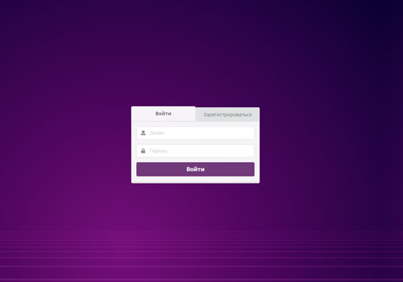
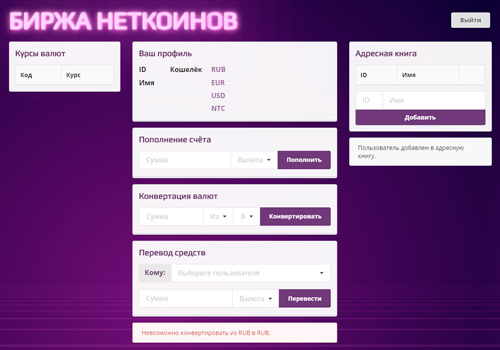

# Дипломное задание к курсу «Основы JavaScript»

Вы присоединились к команде, которая разрабатывает сайт-биржу для крипто-стартапа. На этом сайте можно покупать внутреннюю валюту компании **Неткоин** и передавать эту валюту другим пользователям сервиса. 

Вы подключаетесь на финальной стадии разработки проекта, поэтому основные его части уже реализованы: есть интерфейс взаимодействия с АPI (бэкендом, где проходят операции с пользователями и денежными средствами), и интерфейс взаимодействия с DOM (графическим интерфейсом, который вы видите в браузере). 

Ваша задача связать эти две части: сделать так, чтобы данные, введённые пользователем, отправлялись на сервер, а информация, предоставленная сервером, отобразилась пользователю.

## Начало работы

### Настройка сервера

1. Установите [NodeJS](https://nodejs.org/en/) для своей операционной системы. Советуем использовать LTS-версию (Long Time Support).
2. Сделайте форк этого репозитория.
3. Клонируйте форкнутый репозиторий.
4. Откройте терминал и перейдите в папку с клонированным репозиторием.
5. Установите зависимости, выполнив команду `npm install`.

Убедитесь, что выполняете команды с правами администратора.

### Запуск сервера

1. Откройте терминал, перейдите в папку с клонированным репозиторием и выполните команду `npm start`. Убедитесь, что в консоли появилась надпись `Server started at 8000`.
2. Перейдите по [ссылке](http://localhost:8000). Вы увидите интерфейс Биржи Неткоинов.

### Завершение работы сервера

1. Если нужно прекратить работу сервера, нажмите комбинацию клавиш `Ctrl+C`.

## Структура проекта

В проекте есть две страницы, функционал которых вам нужно будет реализовать:

1. Страница «Вход и регистрация»:

Код для реализации функционала этой страницы пишите в файле `public/loginPage.js`.

Задание для страницы входа и регистрации находится по [ссылке](./md/loginpage.md).

2. Страница «Личный кабинет пользователя»:

Код для этой страницы пишите в файле `public/homePage.js`.

Задание для страницы личного кабинета находится по [ссылке](./md/homepage.md).

Файлы `public/loginPage.js` и `public/homePage.js` уже созданы для вас и подключены, дополнительная настройка не требуется.

## Отправка работы на проверку

Чтобы отправить работу на проверку, загрузите репозиторий на [GitHub](https://github.com/).

### Как работать над дипломной работой

1. Начинайте работу над дипломом как можно раньше. Так будет больше времени на доработки и исправления.
2. Делайте диплом по частям. Иначе есть шанс, что нужно будет всё переделывать.
3. В случае любой сложности вы можете задать вопрос дипломному руководителю. Но лучше сначала попробовать решить проблему самостоятельно. Прежде чем задавать вопрос, попробуйте найти ответ в лекциях, материалах и домашних заданиях курса. Поищите ответ в Google.
4. Если задаёте вопрос, в одном вопросе опишите одну проблему. Так ответ дипломного руководителя будет максимально подробным и полезным.
5. Не оставляйте вопросы в коде, пишите их текстом, указывая, к какой строке кода у вас вопрос. Для лучшего понимания контекста прикрепите к вопросу скриншоты и стрелкой укажите, что именно вызывает вопрос. Программу для создания скриншотов можно скачать [по ссылке](https://app.prntscr.com/ru/).
