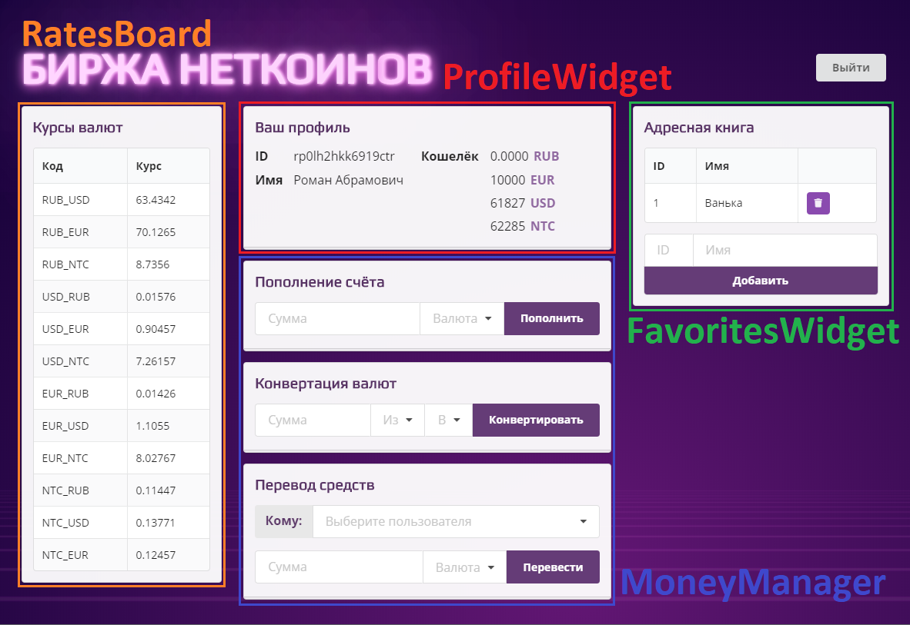

# Реализация страницы «Личный кабинет пользователя».

Перед началом работы ознакомьтесь с [возможностями работы реализованных классов](./classes_description.md).

Для работы с сервером используется класс `ApiConnector`. Для каждого блока функциональностей описан свой класс для удобной работы:

## Особенности
* После регистрации нового пользователя его список избранного пустой. 
* В избранное можно добавить пользователя с любым `id`, но перевести деньги можно только **существующему пользователю**.
* У дефолтных пользователей `oleg@demo.ru`, `ivan@demo.ru` и `petr@demo.ru` в избранном присутствуют существующие пользователи, между которыми можно переводить деньги.

Для полной реализации личного кабинета необходимо реализовать следующие фичи:
## Выход из личного кабинета
Создайте объект класса `LogoutButton`. В свойство `action` запишите функцию, которая будет вызывать запрос деавторизации (`logout`). В колбек запроса добавьте проверку: если запрос выполнился успешно, то обновите страницу (с помощью `location.reload();`).

## Получение информации о пользователе
Выполните запрос на получение текущего пользователя (`current`), в колбеке которого проверьте ответ: если ответ успешный, то вызовите метод отображения данных профиля (`ProfileWidget.showProfile`) в который передавайте данные ответа от сервера.

## Получение текущих курсов валюты
1. Создайте объект типа `RatesBoard`.
2. Напишите функцию, которая будет выполнять запрос получения курсов валют.
3. В случае успешного запроса, очищайте таблицу с данными (`clearTable`) и заполняйте её (`fillTable`) полученными данными.
4. Вызовите данную функцию для получения текущих валют.
5. Напишите интервал, который будет многократно выполняться (раз в минуту) и вызывать вашу функцию с получением валют.

## Операции с деньгами
1. Создайте объект типа `MoneyManager`
2. Реализуйте пополнение баланса:
    1. Запишите в свойство `addMoneyCallback` функцию, которая будет выполнять запрос.
    2. Внутри функции выполните запрос на пополнение баланса (`addMoney`).
    3. Используйте аргумент функции свойства `addMoneyCallback` для передачи данных `data` в запрос.
    4. После выполнения запроса выполните проверку успешности запроса.
    5. В случае успешного запроса отобразите в профиле новые данные о пользователе из данных ответа от сервера (`showProfile`).
    6. Также выведите сообщение об успехе или *ошибку* (причину неудачного действия) пополнении баланса в окне отображения сообщения (`setMessage`).
3. Реализуйте конвертирование валюты:
    1. Запишите в свойство `conversionMoneyCallback` функцию, которая будет выполнять запрос.
    2. Внутри функции выполните запрос на пополнение баланса (`convertMoney`)
    3. Используйте аргумент функции свойства `conversionMoneyCallback` для передачи данных в запрос.
    4. Повторите пункты 2.4-2.7
4. Реализуйте перевод валюты:
    1. Запишите в свойство `sendMoneyCallback` функцию, которая будет выполнять запрос.
    2. Внутри функции выполните запрос на пополнение баланса (`transferMoney`).
    3. Используйте аргумент функции свойства `sendMoneyCallback` для передачи данных в запрос.
    4. Повторите пункты 2.4-2.7

## Работа с избранным
1. Создайте объект типа `FavoritesWidget`
2. Запросите начальный список избранного:
    1. Выполните запрос на получение списка избранного (`getFavorites`).
    2. В колбеке запроса проверяйте успешность запроса.
    3. При успешном запросе очистите текущий список избранного (`clearTable`).
    4. Отрисуйте полученные данные (`fillTable`).
    5. Заполните выпадающий список для перевода денег (`updateUsersList`).
3. Реализуйте добавления пользователя в список избранных:
    1. Запишите в свойство `addUserCallback` функцию, которая будет выполнять запрос.
    2. Внутри функции выполните запрос на добавление пользователя (`addUserToFavorites`).
    3. Используйте аргумент функции свойства `addUserCallback` для передачи данных пользователя в запрос.
    4. После выполнения запроса выполните проверку успешности запроса.
    5. В случае успеха запроса выполните пункты 2.3-2.5
    6. Также выведите сообщение об успехе или *ошибку* (причину неудачного действия) добавлении пользователя в окне отображения сообщения (`setMessage`).
4. Реализуйте удаление пользователя из избранного
    1. Запишите в свойство `removeUserCallback` функцию, которая будет выполнять запрос.
    2. Внутри функции выполните запрос на удаление пользователя (`removeUserFromFavorites`).
    3. Используйте аргумент функции свойства `removeUserCallback` для передачи данных пользователя в запрос.
    4. После запроса выполните пункты 3.4-3.6
